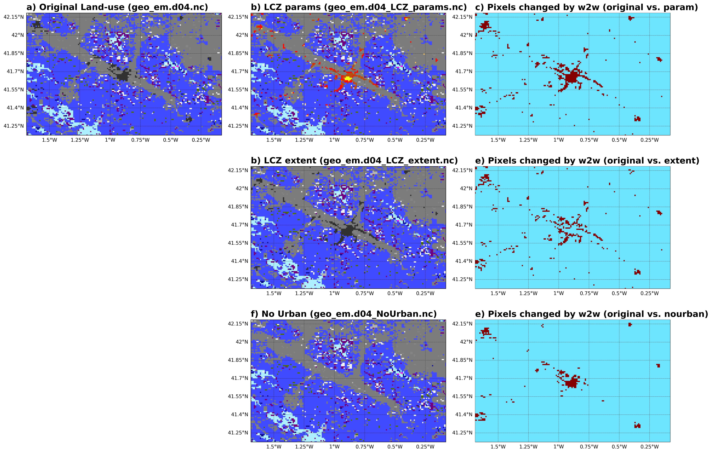

[](https://github.com/matthiasdemuzere/w2w/actions/workflows/ci.yml)
[](https://results.pre-commit.ci/latest/github/matthiasdemuzere/w2w/main)
[](https://doi.org/10.21105/joss.04432)

w2w.py
======
A WUDAPT-to-WRF python tool that injects [WUDAPT's](https://wudapt.org) Local Climate Zone information into [WRF](https://github.com/wrf-model/WRF).

Install
------------
`pip install w2w`

Install from GitHub:

`pip install git+https://github.com/matthiasdemuzere/w2w`

Run the tool
-------

1. Check out its help:
```sh
w2w --help
```
2. Try with the provided sample:

   Sample data used here can be downloaded from the [repository](https://github.com/matthiasdemuzere/w2w/) in the [`sample_data` folder](https://github.com/matthiasdemuzere/w2w/tree/main/sample_data). After clicking on the file you can download it.
```sh
w2w ./sample_data lcz_zaragoza.tif geo_em.d04.nc WRF_VERSION
```

with WRF_VERSION being one of the following (versions will be updated when new WRF releases become available):
- 'v4.3'
- 'v4.3.1'
- 'v4.3.2'
- 'v4.3.3'
- 'v4.4'
- 'v4.4.1'
- 'v4.4.2'
- 'v4.5'
- 'v4.5.1'
- 'v4.5.2'


3. Deploy using your own data:
```sh
w2w INPUT_DIRECTORY YOUR_LCZ.TIF YOUR_GEO_EM.dXX.NC WRF_VERSION
```
Output
-------

   The **original files are not modified**. Three new files are generated by `w2w`:
   - geo_em.d04_NoUrban.nc: Urban areas are replaced with the dominant surrounding rural land use.
   - geo_em.d04_LCZ_extent.nc: The extension of urban areas is updated using LCZ.
    - geo_em.d04_LCZ_params.nc: Urban areas are described using three different urban density categories.

   Differences between the original file and the newly created files by `w2w` are shown below for the sample data provided.


Fig.1: w2w results on sample data. Land use categories from the original file (a), the params file (b), the extent file (d) and the NoUrban (f). Pixels replaced with respect to the original file in params (c), extent (e) and NoUrb (g).
</p>

   A [sample Jupyter notebook](./sample_data/plotting_w2w_before_after.ipynb) is provided to recreate this Figure but is not part of the package, thus additional modules are required to run it.


Requirements
-------
1. A **geo_em.dXX.nc file** (produced by WRF's WPS geoegrid.exe), for the inner WRF model domain in which you would like to use the LCZ-based information.


2. A **Local Climate Zone map** (lcz.tif) that is slightly bigger than the domain of the geo_em.d0**X**.nc file. There are a number of ways to obtain an LCZ map for your region of interest:

   * Extract your domain from the continental-scale LCZ maps for Europe ([Demuzere et al., 2019](https://doi.org/10.1371/journal.pone.0214474)) or the United States ([Demuzere et al., 2020](https://doi.org/10.1038/s41597-020-00605-z)). For more information, see [here](https://www.wudapt.org/lcz-maps/). Make sure you use the version ending with *_epsg4326.tif*.
   * Check if your region of interest is already covered by the many LCZ maps available in the [LCZ Generator submission table](https://lcz-generator.rub.de/submissions).
   * Use the [LCZ Generator](https://lcz-generator.rub.de/) to make an LCZ map for your region of interest. In case the geo_em.d0**X**.nc domain is larger than ~ 2.5 x 2.5°, the LCZ Generator will fail. In that case, please contact [Matthias Demuzere](mailto:matthias.demuzere@rub.de) for support.


3. Know about the **WRF version** you are using. Initially, LCZ classes were numbered from 30 to 41. Yet from WRF v4.4.2, the LCZ numbers in WRF-urban are changed from 31-41 to 51-61. This in order to avoid overlap with existing NLCD land types. For more info, see [here](https://github.com/wrf-model/WRF/releases/tag/v4.4.2).

Important notes
-------
* Your LCZ .tif and geo_em*.dXX.nc files should both live in the INPUT_DIRECTORY.
* Also, this INPUT_DIRECTORY should be writeable by the user.
* Also the geo_em.d0[**0 to X**].nc file(s) of the parent domain(s) should be available in the INPUT_DIRECTORY. This is needed because the `w2w.py` routine will check whether `NUM_LAND_CAT` is set to 41 or 61 (depending on your WRF version) in all these parent domain files. If that is not the case, this will be fixed by writing out adjusted geo_em.d0[**0 to X**]_41.nc or geo_em.d0[**0 to X**]_61.nc files.
* In case you use an LCZ map produced by the LCZ Generator, by default `-lcz_band 1` will be used, which is the best-quality gaussian filtered LCZ map (see [Demuzere et al. (2021)](https://doi.org/10.3389/fenvs.2021.637455) for more info).
* Once the adjusted **geo_em.dXX.nc files** are created (geo_em.d01_41/61.nc, ..., geo_em.dXX_NoUrban.nc, geo_em.dXX_LCZ_extent.nc, geo_em.dXX_LCZ_params.nc), make sure to rename them (e.g. rename geo_em.d01_41/61.nc to geo_em.d01.nc, or geo_em.d04_LCZ_params.nc to geo_em.d04.nc) before using them as input to the metgrid.exe module. See documentation for more info.
* It is advised to use this tool with urban parameterization options BEP or BEP+BEM (`sf_urban_physics = 2 or 3`, respectively). In case you use this tool with the SLUCM model (`sf_urban_physics = 1`), make sure your lowest model level is above the highest building height. If not, real.exe will provide the following error message: `ZDC + Z0C + 2m is larger than the 1st WRF level - Stop in subroutine urban - change ZDC and Z0C`.
* At the end of running `W2W`, a note is displayed that indicates the `nbui_max` value, e.g. for the sample data: `Set nbui_max to 5 during compilation, in order to optimize memory storage`. This is especially relevant for users that work with the BEP or BEP+BEM urban parameterization schemes (`sf_urban_physics = 2 or 3`, respectively). See also `num_urban_nbui` in [WRF's README.namelist](https://github.com/wrf-model/WRF/blob/master/run/README.namelist) for more info.
* Make sure to set `use_wudapt_lcz=1` (default is 0) and `num_land_cat=41` or `num_land_cat=61` (depending on WRF version, default is 21) in WRF's `namelist.input` when using the LCZ-based urban canopy parameters.
* The outputs of this tool have only been tested with the most recent [WRF version 4.3.x](https://github.com/wrf-model/WRF/releases/tag/v4.3). So we advise you to work with this version as well, which is now able to ingest the urban LCZ classes by default.
* It is possible to specify the number of nearest pixels (NPIX_NLC) to determine the dominant natural landuse in the surroundings of each urban pixel. The most frequent landuse among those pixels is used to replace the urban pixels. The distance used to find the nearest pixels is based on the great circle arc length. For performance reasons, the nearest pixels are searched using a k-d tree algorithm, instead of brute forcing over all possible pixels. Because only land natural pixels are considered to calculate the most frequent land use, we need to filter out water and other urban pixels. Thus, we need to specify the initial number of pixels (NPIX_AREA) that the k-d tree algorithm will select, which will be larger than NPIX_NLC. By default, NPIX_AREA = NPIX_NLC**2 pixels will be selected and the nearest NPIX_NLC (default is 45) pixels that are not water or urban will be drawn from that initial selection. Because it is actually an area around the urban pixel, it is referred to as NPIX_AREA.


Arguments
-------

* Additional arguments to be used:

```
-b --built-lcz = LCZ classes considered as urban (DEFAULT: [1, 2, 3, 4, 5, 6, 7, 8, 9, 10])
-l --lcz-band = Band to use from LCZ file (DEFAULT: 0). For maps produced with LCZ Generator, use 1
-f --frc-threshold = FRC_URB2D threshold value to assign pixel as urban (DEFAULT: 0.2)
-n --npix-nlc = Number of pixels to use for sampling neighbouring natural land cover (DEFAULT: 45)
-a --npix_area = Area in number of pixels to look for the NPIX_NLC nearest number of pixels for sampling neighbouring natural land cover (DEFAULT: NPIX_NLC**2)
--lcz-ucp = Specify a custom lookup table for the LCZ-based Urban Canopy Parameters
```

* Using a custom lookup table for the LCZ-based urban canopy parameters

  - you can create a custom csv-file based on this format and use it specifying it with the `--lcz-ucp` flag. For the example: `w2w ./sample_data lcz_zaragoza.tif geo_em.d04.nc --lcz-ucp path/to/custom_lcz_ucp.csv`
  - A table must have this this format (indentation optional). The table displayed below is the default table.

```csv
   ,FRC_URB2D ,MH_URB2D_MIN ,MH_URB2D ,MH_URB2D_MAX ,BLDFR_URB2D ,H2W
1  ,0.95      ,25           ,50       ,75           ,0.5         ,2.5
2  ,0.9       ,10           ,17.5     ,25           ,0.55        ,1.25
3  ,0.85      ,3            ,6.5      ,10           ,0.55        ,1.25
4  ,0.65      ,25           ,50       ,75           ,0.3         ,1
5  ,0.7       ,10           ,17.5     ,25           ,0.3         ,0.5
6  ,0.6       ,3            ,6.5      ,10           ,0.3         ,0.5
7  ,0.85      ,4            ,5        ,6            ,0.75        ,1.5
8  ,0.85      ,3            ,6.5      ,10           ,0.4         ,0.2
9  ,0.3       ,3            ,6.5      ,10           ,0.15        ,0.15
10 ,0.55      ,5            ,10       ,15           ,0.25        ,0.35
11 ,0         ,0            ,0        ,0            ,0           ,0
12 ,0         ,0            ,0        ,0            ,0           ,0
13 ,0         ,0            ,0        ,0            ,0           ,0
14 ,0         ,0            ,0        ,0            ,0           ,0
15 ,0.95      ,0            ,0        ,0            ,0.05        ,0
16 ,0         ,0            ,0        ,0            ,0           ,0
17 ,0         ,0            ,0        ,0            ,0           ,0
```


Background context
-------
An important objective of WUDAPT, the World Urban Database and Access Portals Tools community project, is to generate urban canopy information and provide the (open-source) tools to facilitate urban-focused modelling studies ([Ching et al., 2018](http://journals.ametsoc.org/doi/10.1175/BAMS-D-16-0236.1)).

Since the work of [Brousse et al. (2016)](https://doi.org/10.1016/j.uclim.2016.04.001), the level-0 WUDAPT information, the Local Climate Zone maps, have been used increasingly in [WRF](https://github.com/wrf-model/WRF), the community “Weather Research and Forecasting” model. Their original guide and code on how to use WUDAPT information into WRF (originally designed for WRF v3.2) is available [here](https://www.wudapt.org/wudapt-to-wrf/). Note that this tool was first assigning the LCZ mode to each WRF grid cell, and only afterwards assigning corresponding morphological, radiative and thermal properties to this modal LCZ class. This is done differently in w2w, see below.

As of spring 2021, [WRF v4.3.x](https://github.com/wrf-model/WRF/releases/tag/v4.3) is able to ingest LCZ information by default (previous versions required manual WRF code changes by the user). See more details on "*Updates of WRF-urban in WRF 4.3: Local Climate Zones, Mitigation Strategies, building materials permeability and new buildings drag coefficient*" [here](https://ral.ucar.edu/sites/default/files/public/product-tool/urban-canopy-model/WRF_urban_update_Readme_file_WRF4.3.pdf). Because of this, we decided to simultaneously built an improved WUDAPT-to-WRF routine, to make the translation of LCZ-based parameters better and simpler. As before, the LCZ-based urban canopy parameters generally follow the values provided by [Stewart and Oke (2012)](http://doi.org/10.1175/BAMS-D-11-00019.1) and [Stewart et al. (2014)](http://doi.org/10.1002/joc.3746).

The procedure in this new `w2w` tool is different from the former tool. Morphological parameters are assigned directly to the high-resolution LCZ map, and only afterwards aggregated to the WRF grid. In this way, the method produces a unique value of the different urban morphology parameters for each model cell. This was found to be more efficient in reproducing urban boundary layer features, especially in the outskirts of the city [(Zonato et al., 2020)](https://doi.org/10.1016/j.uclim.2020.100584), and is in line with the [WUDAPT-to-COSMO](https://github.com/matthiasdemuzere/WUDAPT-to-COSMO) routine [(Varentsov et al., 2020)](https://www.mdpi.com/2073-4433/11/12/1349). Other radiative and thermal parameters are for now still assigned to the modal LCZ class. More details on the procedure and its assumptions will soon be available [here](https://github.com/matthiasdemuzere/w2w#documentation--citation).


How to cite?
-------
Demuzere, M., Argüeso, D., Zonato, A. and Kittner, J. (2022). W2W: A Python package that injects WUDAPT's Local Climate Zone information in WRF. Journal of Open Source Software, 7(76), 4432, DOI: [10.21105/joss.04432](https://doi.org/10.21105/joss.04432).


License
-------
The project is licensed under the [MIT license](https://github.com/matthiasdemuzere/w2w/blob/main/LICENSE).


Contributing
-------
Contributions to `w2w` are welcome! This is how:

- **Bugs:** If you find a bug, please report it by opening an issue. if possible, please attach the complete error/Traceback, the `w2w` version used, and other details like the `WRF` version.

- **Fixing Issues:** If you want to contribute by fixing an issue, please check the issues: contributions are welcome for all open issues especially those with labels  [`bug`](https://github.com/matthiasdemuzere/w2w/labels/bug), [`help wanted`](https://github.com/matthiasdemuzere/w2w/labels/help%20wanted) or [`good first issue`](https://github.com/matthiasdemuzere/w2w/labels/good%20first%20issue) for easy contributions.

- **Enhancement:** New features and modules are welcome! You can check the issues: contributions are welcome for open issues with labels [`enhancement`](https://github.com/matthiasdemuzere/w2w/labels/enhancement) and [`help wanted`](https://github.com/matthiasdemuzere/w2w/labels/help%20wanted).

### Running the tests

The project uses [`tox`](https://tox.wiki/en/latest/) to check the package installs correctly and all tests pass on different versions of python. The tests can be run using:

- all tests against all supported python versions can be run using:
   ```console
   tox
   ```
- a specific test can be run by specifying the `pytest` test id. In this case we only test against python 3.9 (`-e py39` argument)
   ```console
   tox -e py39 tests/w2w_test.py::<name_of_the_test>
   ```

[pytest](https://docs.pytest.org/) can also be used directly:

1. install the package in the current virtual environment (`-e` editable install)
   ```console
   pip install -e .
   ```
1. install the development dependencies
   ```console
   pip install -r requirements-dev.txt
   ```
1. run pytest
   ```console
   pytest
   ```

Artists
-------
* [Matthias Demuzere](https://github.com/matthiasdemuzere): Lead developer
* [Daniel Argueso](https://github.com/dargueso): WRF expert
* [Andrea Zonato](https://github.com/andreazonato): WUDAPT-WRF expert and liaison
* [Jonas Kittner](https://github.com/theendlessriver13): Python wizard


Credits
-------
* We appreciate the feedback and suggestions provided by [Alberto Martilli](https://github.com/albertomartilli) and [Oscar Brousse](https://github.com/oscarbrousse), lead developers of the original Fortran-based WUDAPT-to-WRF fortran package.
* Thanks to [Alberto Martilli](https://github.com/albertomartilli) and Alejandro Rodriguez Sanchez for allowing us to use of their Zaragoza case-study files as sample data.
